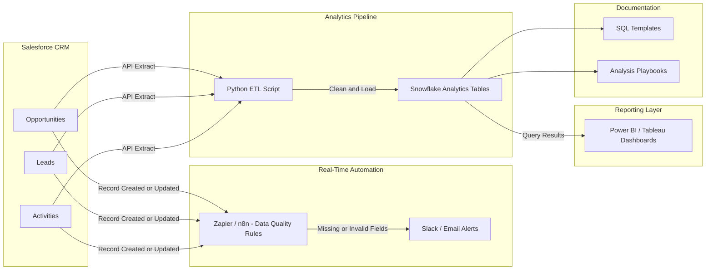

# 🚀 Sales Ops Automation & Data Quality Monitoring System

> **A lightweight Sales Operations automation and analytics framework** that enforces CRM data quality, eliminates manual reporting, and delivers a trusted source of revenue insights.

---

## 📌 Overview

This project showcases a **real-world Sales Operations (RevOps) system** that combines:

* ⚡ **Real-time CRM automation**
* 🔄 **Batch analytics pipelines**
* 📊 **Leadership-ready dashboards**

The result is a scalable, low-maintenance system that keeps sales data clean, reliable, and decision-ready.

---

## ❗ Problem Statement

Sales Ops teams often struggle with:

* ❌ Missing or inconsistent CRM fields
* 🐢 Manual reporting and slow insights
* 📉 Broken dashboards and inaccurate forecasts

This project addresses these gaps by enforcing **data hygiene at the source** and centralizing analytics into a **single source of truth**.

---

## 🧱 Architecture




---

## 🔄 Data Flow

### ⚡ Real-Time Automation (Zapier / n8n)

* Monitors Salesforce record updates
* Flags missing or invalid fields instantly
* Sends alerts to Slack or Email

### 🧮 Batch Analytics Pipeline

* Extracts CRM data via Python
* Cleans and standardizes records
* Loads structured data into Snowflake

### 📊 Reporting Layer

* Power BI / Tableau dashboards provide:

  * Pipeline health
  * Stage conversion rates
  * Rep activity trends
  * Data completeness metrics

---

## 🛠️ Tech Stack

### 🔹 CRM & Automation

* Salesforce
* Zapier / n8n

### 🔹 Data & Analytics

* SQL (Joins, CTEs, Window Functions)
* Python (Pandas, API integrations)
* Snowflake

### 🔹 Visualization

* Power BI
* Tableau

### 🔹 Collaboration & Docs

* GitHub
* Markdown

---

## ✨ Key Features

* ✅ Real-time CRM data quality enforcement
* 🔔 Automated alerts for missing or invalid fields
* 🧱 Lightweight Python + SQL data pipelines
* 📈 Centralized reporting layer
* 📘 Reusable SQL templates and playbooks

---

## ⚙️ Example Automations

### 🟡 Salesforce Data Quality Alert

* **Trigger:** Opportunity updated
* **Condition:** Missing Stage or Close Date
* **Action:** Slack / Email alert

### 🟢 Pipeline Change Tracker

* **Trigger:** Opportunity stage change
* **Action:** Log movement and notify stakeholders

---

## 🧾 Sample SQL Analysis

```sql
WITH pipeline AS (
  SELECT
    stage_name,
    COUNT(*) AS deal_count,
    SUM(amount) AS pipeline_value
  FROM opportunities
  WHERE is_closed = false
  GROUP BY stage_name
)
SELECT *
FROM pipeline
ORDER BY pipeline_value DESC;
```

---

## 📚 Documentation & Playbooks

This repository includes:

* 📄 Reusable SQL templates for recurring analyses
* 🧭 Playbooks explaining automation logic
* 🔁 Steps to rerun and troubleshoot pipelines

Designed for **repeatability and fast onboarding**.

---

## 📈 Outcomes & Impact

* ⏱️ Reduced manual Sales Ops reporting effort
* 🧹 Improved CRM data reliability
* 🚦 Faster detection of pipeline bottlenecks
* 🧠 Better decision-making through clean insights

---

## 💡 Why This Project Matters

This project mirrors **modern Sales Ops systems** used by high-growth SaaS and marketplace companies.

It demonstrates:

* Builder mindset
* Strong SQL & Python fundamentals
* Practical automation skills
* End-to-end ownership of data flow

---

## 🔮 Future Enhancements

* 🔍 Anomaly detection on pipeline metrics
* 🔄 Expanded automation for Leads & Activities
* 🏗️ Migration to fully self-hosted n8n workflows

---

## 👤 Author

**Aditya Sahni**
Sales Operations | Revenue Analytics | Automation


